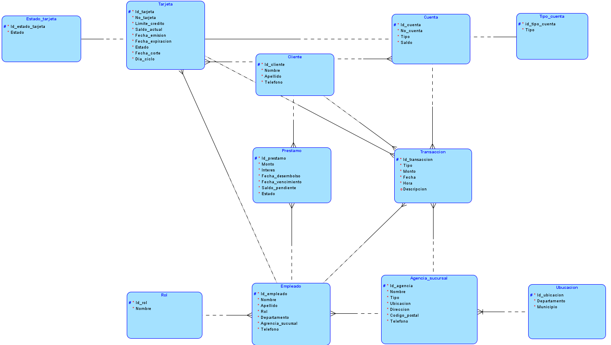
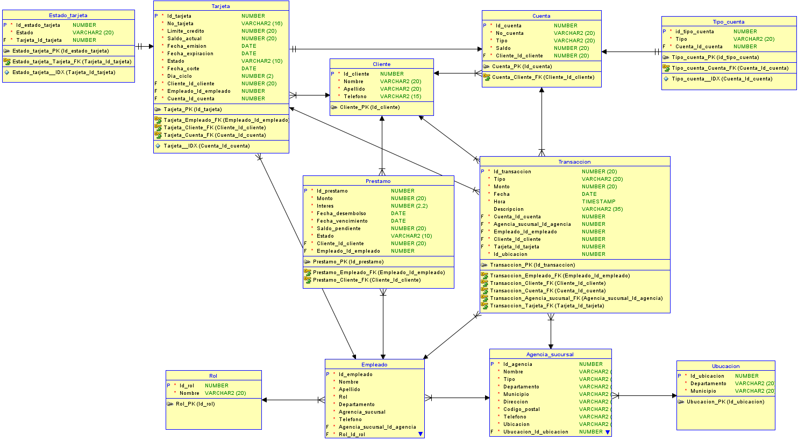

# **Proyecto1 - Sistema Bancario PJ Morgan**

> Brandon Tejaxún - 202112030

## 🔧 Herramientas:
<div align="center" style="display:flex;justify-content:center;gap:20px">
 <a href="https://skillicons.dev">
    
    
  </a>
</div>

## **Estructura Operacional**

1. Clientes
    * 1 millón registrados
    * Cuentas:
        * Monetaria
        * Ahorro
        * Corriente

2. Transacciones
    * 500k transacciones
    * Tipo:
        * Depósitos
        * Retiros
        * Transferencias
        * Pagos

3. Préstamos
    * 100k otorgados
        * 5k - 1M
        * Interés: 3% - 15%

4. Tarjetas de Crédito
    * 100k emitidas
    * Límites:
        * Crédito
        * Saldo
        * Fecha de emisión
        * Fecha de expiración
        * Ciclos de facturación

5. Sucursales/Agencias
    * 1.1k sucursales
    * 3k agencias

6. Empleados
    * 11k empleados

## **Casos de Uso**

1. Cliente
    * Registrar nueva cuenta
    * Consultar saldo de cuentas
    * Realizar depósitos y retiros
    * Transferir dinero entre cuentas
    * Solicitar préstamos
    * Administrar tarjetas de crédito
    * Consultar historial de transacciones

2. Gerente de Sucursal
    * Aprobar solicitudes de préstamos
    * Emitir tarjetas de crédito
    * Gestionar cuentas de clientes
    * Supervisar las operaciones diarias de la sucursal
    * Asignar y gestionar empleados

3. Asesor Financiero
    * Ofrecer asesorias sobre productos financieros
    * Procesar solicitudes de préstamos
    * Gestionar inversiones y seguros para los clientes
    * Proporcionar recomendaciones personalizadas basada en el perfil del cliente

4. Cajero
    * Procesar depósitos y registros de clientes
    * Gestionar pagos de servicios
    * Realizar transferencias entre cuentas

5. Administrador
    * Auditar todas las operaciones del sistema
    * Supervisar el cumplimiento normativo
    * Gestionar los reportes de rendimiento y las estadísticas del banco
    * Gestionar la seguridad del sistema y los accesos

## **Esquema de Base de Datos**

### Secuencias

Esta secuencia `incRol` se utiliza para generar los valores del campo `Id_rol` en la tabla `ROL`. De igual forma, otras tablas también tienen sus propias secuencias como `incClt`, `incAgs`, `incCta`, etc.

```sql
CREATE SEQUENCE incRol START WITH 1 INCREMENT BY 1;
```

### Tabla CLIENTE

```sql
CREATE TABLE CLIENTE (
    Id_cliente  NUMBER       NOT NULL PRIMARY KEY,
    Nombre      VARCHAR2(20) NOT NULL,
    Apellido    VARCHAR2(20) NOT NULL,
    Telefono    VARCHAR2(15) NOT NULL
);
```

Relación: `Id_cliente` es utilizado como clave foránea en varias tablas, como `CUENTA`, `TARJETA`, `PRESTAMO`, y `TRANSACCION`, lo que indica que un cliente puede tener cuentas, tarjetas, préstamos y participar en transacciones.

### Tabla AGENCIA_SUCURSAL

```sql
CREATE TABLE AGENCIA_SUCURSAL (
    Id_agencia           NUMBER       NOT NULL PRIMARY KEY,
    Nombre               VARCHAR2(35) NOT NULL,
    Tipo                 VARCHAR2(10) NOT NULL,
    Departamento         VARCHAR2(20) NOT NULL,
    Municipio            VARCHAR2(20) NOT NULL,
    Direccion            VARCHAR2(20) NOT NULL,
    Codigo_postal        VARCHAR2(5)  NOT NULL,
    Telefono             VARCHAR2(15) NOT NULL
);
```

Relación: `Id_agencia` es una clave foránea en las tablas `EMPLEADO` y `TRANSACCION`, lo que implica que tanto los empleados como las transacciones están vinculados a una agencia específica.

### Tabla CUENTA

```sql
CREATE TABLE CUENTA (
    Id_cuenta           NUMBER       NOT NULL PRIMARY KEY,
    No_cuenta           VARCHAR2(20) NOT NULL UNIQUE,
    Tipo                VARCHAR2(20) NOT NULL,
    Saldo               NUMBER(20)   NOT NULL,
    Cliente_id_cliente  NUMBER       NOT NULL,
    CONSTRAINT Fk_Cuenta_Cliente
        FOREIGN KEY (Cliente_id_cliente)
        REFERENCES CLIENTE(Id_cliente)
);
```

Relación: La relación principal es con la tabla `CLIENTE`, ya que cada cuenta pertenece a un cliente específico.
También se relaciona indirectamente con `TRANSACCION`, ya que las transacciones pueden afectar a las cuentas bancarias.

### Tabla EMPLEADO

```sql
CREATE TABLE EMPLEADO (
    Id_empleado  NUMBER       NOT NULL PRIMARY KEY,
    Nombre       VARCHAR2(20) NOT NULL,
    Apellido     VARCHAR2(20) NOT NULL,
    Rol          VARCHAR2(20) NOT NULL,
    Telefono     VARCHAR2(15) NOT NULL,
    Id_agencia   NUMBER       NOT NULL,
    Id_rol       NUMBER       NOT NULL,
    CONSTRAINT Fk_Empleado_Agencia
        FOREIGN KEY (Id_agencia)
        REFERENCES AGENCIA_SUCURSAL(Id_agencia),
    CONSTRAINT Fk_Empleado_Rol
        FOREIGN KEY (Id_rol)
        REFERENCES ROL(Id_rol)
);
```

Relación: `Id_agencia` relaciona a los empleados con una sucursal.
`Id_rol` relaciona a los empleados con un rol dentro de la empresa.
`Id_empleado` se utiliza como clave foránea en `PRESTAMO` y `TRANSACCION`, lo que vincula a un empleado con préstamos y transacciones que han gestionado.

### Tabla TARJETA

```sql
CREATE TABLE TARJETA (
    Id_tarjeta          NUMBER       NOT NULL PRIMARY KEY,
    No_tarjeta          VARCHAR2(20) NOT NULL UNIQUE,
    Limite_credito      NUMBER(20)   NOT NULL,
    Saldo_actual        NUMBER(20)   NOT NULL,
    Fecha_vencimiento   DATE         NOT NULL,
    Fecha_expiracion    DATE         NOT NULL,
    Estado              VARCHAR2(10) NOT NULL,
    Fecha_corte         DATE         NOT NULL,
    Dia_ciclo           NUMBER       NOT NULL,
    Id_cliente          NUMBER       NOT NULL,
    CONSTRAINT Fk_Tarjeta_Cliente
        FOREIGN KEY (Id_cliente)
        REFERENCES CLIENTE(Id_cliente)
);
```

Relación: Cada tarjeta está vinculada a un cliente mediante la clave foránea `Id_cliente`, lo que indica quién es el titular de la tarjeta.

### Tabla PRESTAMO

```sql
CREATE TABLE PRESTAMO (
    Id_prestamo         NUMBER       NOT NULL PRIMARY KEY,
    Monto               NUMBER(20)   NOT NULL,
    Interes             NUMBER(2,2)  NOT NULL,
    Fecha_desembolso    DATE         NOT NULL,
    Fecha_vencimiento   DATE         NOT NULL,
    Saldo_pendiente     NUMBER(20)   NOT NULL,
    Estado              VARCHAR2(10) NOT NULL,
    Id_cliente          NUMBER       NOT NULL,
    Id_empleado         NUMBER       NOT NULL,
    CONSTRAINT Fk_Prestamo_Cliente
        FOREIGN KEY (Id_cliente)
        REFERENCES CLIENTE(Id_cliente),
    CONSTRAINT Fk_Prestamo_Empleado
        FOREIGN KEY (Id_empleado)
        REFERENCES EMPLEADO(Id_empleado)
);
```

Relación: `Id_cliente` indica el cliente que solicitó el préstamo.
`Id_empleado` indica el empleado que gestionó el préstamo.

### Tabla TRANSACCION

```sql
CREATE TABLE TRANSACCION (
    Id_transaccion              NUMBER       NOT NULL PRIMARY KEY,
    Tipo                        VARCHAR2(20) NOT NULL,
    Monto                       NUMBER(20)   NOT NULL,
    Fecha                       DATE         NOT NULL,
    Hora                        TIMESTAMP    NOT NULL,
    Descripcion                 VARCHAR2(35),
    Id_cuenta                   NUMBER       NOT NULL,
    Id_agencia                  NUMBER       NOT NULL,
    Id_cliente                  NUMBER       NOT NULL,
    Id_empleado                 NUMBER       NOT NULL,
    CONSTRAINT FK_Transaccion_Cuenta
        FOREIGN KEY (Id_cuenta)
        REFERENCES CUENTA(Id_cuenta),
    CONSTRAINT FK_Transaccion_Agencia
        FOREIGN KEY (Id_agencia)
        REFERENCES AGENCIA_SUCURSAL(Id_agencia),
    CONSTRAINT FK_Transaccion_Cliente
        FOREIGN KEY (Id_cliente)
        REFERENCES CLIENTE(Id_cliente),
    CONSTRAINT FK_Transaccion_Empleado
        FOREIGN KEY (Id_empleado)
        REFERENCES EMPLEADO(Id_empleado)
);
```

Relación: `Id_cuenta` vincula la transacción con una cuenta.
`Id_agencia` relaciona la transacción con una agencia específica.
`Id_cliente` relaciona la transacción con un cliente.
`Id_empleado` vincula la transacción con el empleado que la realizó.

## **Diseño Lógico y Entidad Relación**

<div align="center">
    
    
</div>